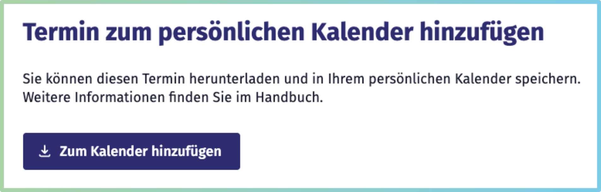

[« Zurück](/get-started)

# Kalenderfunktionen

Der *Smarte Gemeinschaftskalender* ermöglicht es Ihnen, für Sie interessante **Veranstaltungen schnell zu finden und automatisiert informiert** zu bleiben.  
Ob per E-Mail-Benachrichtigung, Integration in Ihren privaten Kalender oder Einbindung auf Ihrer eigenen Website – so bleiben Sie immer auf dem Laufenden.

In diesem Dokumentationsbereich erfahren Sie, wie Sie diese Funktionen nutzen und auf Ihre Bedürfnisse anpassen können.

## Veranstaltungen suchen und filtern

Um schnell die für Sie relevanten Veranstaltungen zu finden, können Sie die *klassische Veranstaltungssuche* oder die *Kalenderansicht* nutzen. Auf beide Suchen können Sie über die **obere Menüleiste** (Header-Navigation) zugreifen. 

### Klassische Veranstaltungssuche

Die *klassische Veranstaltungssuche* bietet eine schnelle Möglichkeit, gezielt nach Terminen zu suchen und Ergebnisse einzugrenzen. Sie erreichen Sie über die **Navigationsleiste** im oberen Seitenbereich über den Reiter *Veranstaltungen*.  

- **Suchfeld:** Geben Sie Schlagwörter, Veranstaltungstitel, Organisationen oder Orte ein, um Veranstaltungen zu finden, die zu Ihren Interessen passen. 
 
- **Filteroptionen:** Links neben der Ergebnisliste können Sie Ihre Suchergebnisse präzise filtern:  
  - **Instanz:** Wählen Sie, ob Sie nur Veranstaltungen der aktuellen Kalenderinstanz oder auch verbundener Instanzen sehen möchten (mehr dazu im Abschnitt [Föderation](/Einführung/#föderation-einzelner-kalenderinstanzen)).  
  - **Zeitraum:** Filtern Sie Veranstaltungen nach Datum – z. B. *heute*, *diese Woche* oder *nächster Monat*.  
  - **Kategorien:** Veranstaltungen sind jeweils einer von **30 Kategorien** zugeordnet. Sie können mehrere Kategorien gleichzeitig auswählen.  
  - **Status der Veranstaltung:** Filtern Sie nach bestätigten, vorläufigen oder abgesagten Veranstaltungen.  
  - **Sprachen:** Begrenzen Sie Ihre Suche auf Veranstaltungen mit bestimmten Veranstaltungssprachen.  

Klicken Sie auf *Suchen*, neben der oberen Suchbegriffsleiste. Nun werden Ihnen alle Veranstaltungen angezeigt, die Ihren Kriterien entsprechen. 

### Kalenderansicht

Die **Kalenderansicht** bietet Ihnen eine übersichtliche Darstellung der Veranstaltungen. Sie erreichen Sie über die *Navigationsleiste* im oberen Seitenbereich über den Reiter *Kalender*. 

**Darstellungsoptionen:**  
- **Wochenansicht:** Standardansicht mit kompaktem Überblick der laufenden Woche.  
- **Monatsansicht:** Wechselt per Button zu einer Monatsübersicht.

**Navigation**
- Mit den **Pfeilen links und rechts** rufen Sie vorangegangene oder die nächste Woche bzw. den Monat auf.
- Über den Button **„Heute“** gelangen Sie jederzeit zurück zum aktuellen Tag.  

**Filteroptionen:**  
Die Filterfunktionen **Instanz, Status, Sprache und Kategorie** funktionieren analog zur [klassischen Veranstaltungssuche](/DSG%20Funktionen/#Klassische-Veranstaltungssuche), mit der Besonderheit, dass die 30 Veranstaltungskategorien zu **fünf Oberkategorien** zusammengefasst werden. Hintergrund ist die Übersichtlichkeit, da die einzelnen Kategorien Farben zugeordnet sind und eine visuelle Unterscheidbarkeit gewährleistet werden muss.  
  

#### Zuordnung der Kategorien

| Oberkategorie                | Enthaltene Kategorien (Beispiele)          |
|-----------------------------|--------------------------------------------|
| Kultur & Kreatives          | Darstellende & bildende Kunst, Film & Medien, Theater, Sprache & Kultur, Fotografie, Musik, Kunsthandwerk, Kabarett, Kunst    |
| Gemeinschaft & Engagement   | Ehrenamt, LGBTQIA+, Netzwerke, Gesellschaft & Politik, “Glauben, Religion & Spiritualität”, Lesekreise, Treffen, Benefiz & Spendenaktionen, Familie, Gemeinschaft & Ehrenamt|
| Familie & Freizeit          | Natur & Abenteuer, Tiere & Haustiere, Tanzen & Feiern, Mode & Schönheit, Spiele & Gaming, “Autos, Boote, Luftfahrt”, Essen & Trinken|
| Gesundheit & Bewegung       | Gesundheit, Sport|
| Wirtschaft & Bildung        | Wissenschaft & Technologie, Bildung, Wirtschaft & Unternehmen|

**Hinweis:** Eine Veranstaltung ist immer genau einer der 30 Kategorien zugeordnet.

Die Kalenderansicht passt sich dynamisch an Ihre Auswahl an. So erhalten Sie jederzeit eine **aktuelle Übersicht** Ihrer Auswahl.

## Kalender abonnieren

Der *Smarte Gemeinschaftskalender* ist **offen und flexibel gestaltet**, sodass seine Schnittstellen vielseitig genutzt und weiterentwickelt werden können.  

Zentral ist die Möglichkeit, **E-Mail-Benachrichtigungen** zu abonnieren: So bleiben Sie automatisch über neue Veranstaltungen informiert – ganz nach Ihren persönlichen Interessen.  

Auch Veranstalter*innen können ihre **eigenen Termine** abonnieren und diese beispielsweise auf ihrer Website einbinden ([siehe Kalender auf eigener Webseite integrieren](#kalender-auf-eigener-webseite-integrieren-script)).  

### E-Mail-Benachrichtigungen

Mit den E-Mail-Benachrichtigungen erhalten Sie regelmäßig eine Übersicht über für Sie relevante Veranstaltungen – personalisiert nach Ihren Wünschen.

**So funktioniert’s:**

1. **Intervall wählen:**  
   Wählen Sie, ob Sie **wöchentlich (Montagmorgen)** oder **monatlich (zum 1. des Monats)** informiert werden möchten.

2. **Kategorien filtern:**  
   Legen Sie fest, ob Sie zu allen **30 Veranstaltungskategorien** oder einer bestimmen Kategorie Benachrichtigungen erhalten möchten   ([Übersicht der Kategorien](#zuordnung-der-kategorien)).

3. **Wählen Sie die Veranstaltungsquelle:**  
   - **Nur Veranstaltungen aus dem aktuellen SG-Kalender:**  
     Sie erhalten ausschließlich Veranstaltungen des gewählten Kalenders (z. B. Amt Süderbrarup). Zusätzlich können Sie hier **nach Organisationen filtern**. Sie können entweder alle Organisationen abonnieren oder eine bestimmte.  
   - **Alle Veranstaltungen aus dem Netzwerk anzeigen:**  
     Mit dieser Option erhalten Sie auch Veranstaltungen aus verbundenen Kalendern. In diesem Fall wird eine **Umkreissuche** aktiviert, über die Sie Veranstaltungen aus angrenzenden Gemeinden, Ortschaften und Organisationen einbeziehen können.

4. **E-Mail-Adresse angeben:**  
   Geben Sie Ihre E-Mail-Adresse in das entsprechende Feld ein und klicken Sie auf **E-Mail-Benachrichtigungen jetzt abonnieren**.

5. **Bestätigung:**  
   Sie erhalten eine **Bestätigungsmail** (dies kann einige Minuten dauern; bitte prüfen Sie auch Ihren Spam-Ordner).  
   Klicken Sie auf den **Bestätigungslink** in der Mail. Es öffnet sich ein Browser-Fenster. Aktivieren Sie hier Ihr Abonnement.

#### Wann erhalte ich meine erste Benachrichtigung?  
Ab dem Zeitpunkt der Bestätigung erhalten Sie Benachrichtigungen im gewählten Intervall.  
Die erste E-Mail wird zum nächsten geplanten Versandtermin versendet – Montagmorgen oder am 1. des kommenden Monats.

### Termine auf Infotafeln anzeigen

Mit dem *Smarten Gemeinschaftskalender* können Sie Veranstaltungen automatisch und rotierend auf **digitalen Infotafeln oder Bildschirmen** anzeigen lassen – z. B. in Rathäusern, Bürgerbüros oder Gemeinschaftshäusern.  
Die Anzeige aktualisiert sich fortlaufend und benötigt **keine zusätzliche Pflege**.

Es gibt zwei Möglichkeiten, eine passende URL für die Infotafel-Ansicht zu erzeugen – über die Veranstaltungssuche und über die Organisationsseite

#### 1. URL über die Veranstaltungssuche erzeugen

1. Öffnen Sie die **Veranstaltungssuche**. Diese finden Sie in der Top-Navigation unter dem Reiter *Veranstaltungen*.
2. Nun können Sie Ihre gewünschten Filterparameter festlegen. Dazu stehen Ihnen zwei Bereiche zur Verfügung:
* **Die Filterleiste:** Hier legen Sie die Instanz, den Zeitraum, die Kategorien, den Veranstaltungsstatus und die Sprache fest, die angezeigt werden sollen. 
* **Das Suchfeld:** Hier können Sie relevante Suchbegriffe hinterlegen, aber auch ausgehend von einem Ort einen Suchumkreis festlegen.
3. Sobald die Einstellungen vorgenommen wurden, klicken Sie auf **Suchen**, um die Filterung zu übernehmen.  
4. Wählen Sie nun oben rechts das **Info-Icon** im Bereich *Suchergebnis teilen*.  
5. Es öffnet sich ein Fenster, in dem die Veranstaltungen aus dem Suchergebnis automatisch durchlaufen. Kopieren Sie die angezeigte URL und hinterlegen Sie diese auf der Infotafel oder einem Bildschirm.  

**Hinweis:**  
Die Ansicht wird **dynamisch aktualisiert**. Wenn Sie z. B. den Zeitraum *Morgen* auswählen, zeigt die URL künftig immer automatisch die Veranstaltungen des kommenden Tages.

#### 2. URL über die Organisationsseite erzeugen

Diese Option ist besonders sinnvoll, wenn alle Veranstaltungen einer Organisation für Sie relevant sind – beispielsweise für eine Infotafel eines konkreten Vereins.

1. Öffnen Sie in der Top-Navigation den Bereich **Organisationen**.  
2. Wählen Sie die gewünschte Organisation aus.  
3. Im Abschnitt **Bevorstehende Veranstaltungen** finden Sie rechts die Funktion *Veranstaltungen teilen*.  
4. Klicken Sie auf das **Info-Icon**, um eine URL zu erzeugen und die Infotafel-Ansicht zu öffnen.  
5. Kopieren Sie die URL und verwenden Sie diese für die Anzeige auf einem Bildschirm oder einer Infotafel.  

**Hinweis:**
Die URL bleibt dauerhaft gültig und wird automatisch mit neuen Veranstaltungen der Organisation aktualisiert.

#### Manuelle Anpassung der Anzeigedauer

Standardmäßig wird jede Veranstaltung **30 Sekunden** angezeigt.  
Falls Sie eine andere Anzeigedauer wünschen, können Sie die erzeugte URL mit einem Parameter am Ende erweitern:
> &showEventInSeconds=60

Ersetzen Sie dabei `60` durch die gewünschte Anzahl an Sekunden.  

### Kalender auf eigener Webseite integrieren 
**Hinweis:** Die Inhalte zu diesem Bereich werden zeitnah ergänzt.

## Veranstaltungen und Suchergebnis teilen

Veranstaltungen können Sie auf unterschiedliche Weise teilen – direkt in der **Veranstaltungssuche**, von der **Organisationsseite** oder der **Detailansicht einer einzelnen Veranstaltung** aus.  

### Zugang zu den Funktionen
- **Veranstaltungssuche:** Über die Top-Navigation im Reiter *Veranstaltungen*. Rechts neben der Suchleiste finden Sie die Funktion *Suchergebnis teilen*.  
- **Organisationen:** Über die Top-Navigation im Bereich *Organisationen*. Wählen Sie dort die gewünschte Organisation aus. Im Abschnitt *Bevorstehende Veranstaltungen* finden Sie die Funktion *Veranstaltungen teilen*.  
- **Einzelne Veranstaltung:** Öffnen Sie die Detailansicht einer Veranstaltung. Dort finden Sie ebenfalls die Icons im bereich *Veranstaltung teilen*.

### Verfügbare Optionen
Mit einem Klick auf eines der Icons öffnet sich die jeweilige Anwendung:  
- **Mastodon**  
- **WhatsApp**  
- **LinkedIn**  
- **Telegram**  
- **E-Mail-Postfach**  
- **Kopieren** (Text wird in die Zwischenablage übernommen)  
- **Info-Icon:** Erzeugt eine URL für die Anzeige auf Infotafeln. Details dazu finden Sie im Abschnitt [Termine auf Infotafeln anzeigen](#termine-auf-infotafeln-anzeigen).

### Inhalte beim Teilen
- Über die **Veranstaltungssuche**: Das Teilen bezieht sich auf das aktuelle Suchergebnis. Nutzen Sie die **Filterleiste**, um passende Filterparameter festzulegen: Instanz, Zeitraum, Kategorien, Status der Veranstaltungen und Sprachen. Über das **Suchfeld** können zudem Suchbegriffe und ein Umkreis definiert werden. Die Auswahl bestimmt, welche Veranstaltungen in der geteilten Übersicht erscheinen.  
  **Hinweis:** Klicken Sie auf *Suchen*, wenn Sie Ihre Suchparameter eingestellt haben, damit diese für die Teilen-Funktionen übernommen werden.  

- Über die **Organisationsseite**: Es werden alle bevorstehenden Veranstaltungen der gewählten Organisation geteilt.  

- Über eine **einzelne Veranstaltung**: Es wird nur die jeweilige Veranstaltung geteilt.  

In allen Fällen erhalten Sie einen Text-Output. Dieser enthält die wichtigsten Veranstaltungsinformationen: **Titel, Datum, Uhrzeit und den Link zur Veranstaltung**.

**Hinweis:**  
Wenn Sie bei einer Plattform (z. B. LinkedIn, Mastodon oder WhatsApp) auf Ihrem Gerät noch nicht eingeloggt sind, werden Sie beim Klick auf das Symbol zunächst zur Anmeldeseite weitergeleitet.

## Veranstaltungsdatei exportieren

In der Detailansicht jeder Veranstaltung können Sie diese als **.ics-Datei** herunterladen und so zu Ihrem persönlichen digitalen Kalender hinzufügen.  
Klicken Sie dafür auf den Button **Zum Kalender hinzufügen**.

### Was ist eine .ics-Datei?
Eine **.ics-Datei** ist ein universelles Kalenderformat, das von nahezu allen gängigen Kalenderprogrammen unterstützt wird, z. B.:
- **Google Kalender**
- **Apple Kalender**
- **Microsoft Outlook**
- und viele weitere.

#### Wie füge ich die Datei meinem Kalender hinzu?
In der Regel genügt es, die heruntergeladene Datei **mit Ihrem Kalenderprogramm zu öffnen**. Der Termin wird dann automatisch importiert beziehungsweise werden Sie gefragt, ob Sie diesen hinzufügen wollen.

**Hinweis:** Die genaue Vorgehensweise kann je nach Programm leicht variieren.