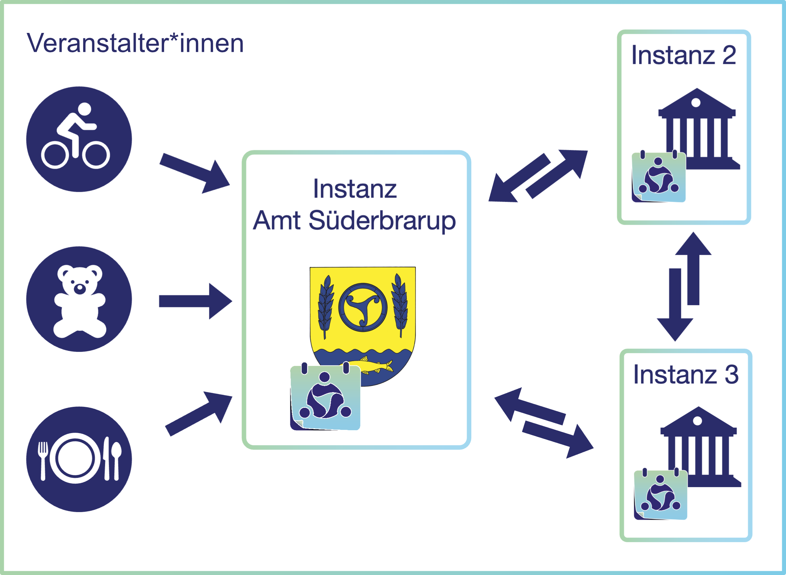

[« Zurück](/get-started)

# Einführung: Der Smarte Gemeinschaftskalender

*Der Smarte Gemeinschaftskalender* ist eine digitale Plattform, die Bürger*innen, Vereinen, Organisationen und öffentlichen Einrichtungen eine zentrale Anlaufstelle für Veranstaltungen und Termine bietet. Ziel ist es, die **Teilhabe am Gemeinschaftsleben** zu erleichtern, **lokales Engagement** sichtbar zu machen und den Austausch durch einfache Bedienbarkeit zu fördern.

## Was macht den Kalender besonders?

**Personalisierte Benachrichtigungen:** 
Um über anstehende Veranstaltungen informiert zu bleiben, ist in der Regel Eigeninitiative gefragt – regelmäßig muss selbst recherchiert werden. Das wollen wir mit dem Smarten Gemeinschaftskalender ändern. Mit der Möglichkeit, Veranstaltungsbenachrichtigungen zu abonnieren, werden Nutzer*innen regelmäßig über anstehende Termine informiert – beispielsweise per E-Mail. Dabei kann das Abonnement in der Regelmäßigkeit und nach Interessengebieten an die persönlichen Vorlieben angepasst werden. 

So wird eine Informationsflut vermieden und Veranstalter*innen erreichen genau die richtigen Menschen!

**Barrierefreiheit:** 
Inklusion gehört zum Grundgedanken des Smarten Gemeinschaftskalenders – wir möchten, dass alle Menschen die Möglichkeit zur gesellschaftlichen Teilhabe erhalten. Einerseits bieten wir daher vielfältige Benachrichtigungswege. Andererseits setzen wir bei der technischen Umsetzung und dem Design auf barrierefreie Standards. Diese werden vollumfänglich auch im Verwaltungsbereich umgesetzt, sodass auch Veranstalter*innen barrierefrei arbeiten können.

**Reduktion des Verwaltungsaufwandes:** 
Häufig bleiben regionale Veranstaltungskalender lückenhaft – denn kleinen und ehrenamtlichen Vereinen und Organisationen fehlen häufig die Kapazitäten, um Termine einzupflegen. Daher setzen wir auf Automationen, die den Prozess deutlich vereinfachen. 
* Vereine erhalten durch die betreibende Stelle der Kalenderinstanz einen eigenen Zugang und müssen Termine nicht über Umwege online stellen.
* Externe digitale Kalender können automatisch angebunden und synchronisiert werden.
* Bereits angelegte Termine können als Datei hochgeladen werden, sodass die Informationen nicht manuell eingetragen werden müssen.
* Mit Serienterminen müssen regelmäßig stattfindende Veranstaltungen nur einmalig angelegt werden.
* Der Werbemittelgenerator bietet eine einfache Möglichkeit, Veranstaltungsübersichten oder Ankündigungen für einzelne Veranstaltungen zu erstellen, um diese beispielsweise auf sozialen Medien zu verbreiten. 

Diese und weitere Funktionen ermöglichen eine einfache und effiziente Terminverwaltung. So wird die Nutzung des Smarten Gemeinschaftskalenders attraktiver gestaltet und ein vollständigeres Bild der Veranstaltungen geschaffen.

**Open-Source-Lizenz und Souveränität:** 
Der Smarte Gemeinschaftskalender ist unter der MIT-Lizenz veröffentlicht. Das bedeutet, dass der Quellcode öffentlich zugänglich ist und alle Interessierten diesen einsehen und kostenfrei nutzen können. Jede Organisation kann eine Kalenderinstanz auf einem eigenen Server betreiben – das hat den großen Vorteil, dass dauerhaft keine Lizenzgebühren anfallen. Zudem ermöglicht diese Lösung die vollständige Datenhoheit und somit einen datenschutzkonformen Betrieb sowie Unabhängigkeit gegenüber amerikanischen Tech-Konzernen.

**Offen und erweiterbar:** 
Durch eine moderne, offene Architektur ist der Smarte Gemeinschaftskalender langfristig ausbaufähig und lässt sich flexibel an lokale Bedürfnisse anpassen. 

## Förderung & Kooperation 

Das Projekt *Der Smarte Gemeinschaftskalender* wird im Rahmen des [Landesprogramms Offene Innovation](https://digitalhub.sh/de/call-for-concept-zum-landesprogramm-offene-innovation) durch den [DigitalHub.SH](https://digitalhub.sh) gefördert. Der Call for Concepts wurde 2024 erstmals ausgerufen: Gesucht wurden Ideen für **Open-Source-Softwarelösungen**, die spezifische Bedürfnisse öffentlicher und gemeinnütziger Organisationen in Schleswig-Holstein adressieren. Ziel dieser Förderung ist es, nachhaltige digitale Projekte mit echtem Mehrwert zu ermöglichen, die Flexibilität, Effizienz und langfristige Unabhängigkeit sicherstellen. 

Teilnehmen konnten öffentliche Verwaltungen und gemeinnützige Organisationen oder Vereine in Kooperation mit einem Digitalunternehmen aus Schleswig-Holstein als Umsetzungspartner. Der Smarte Gemeinschaftskalender wurde in Zusammenarbeit von [Smart City Amt Süderbrarup](https://smartcityamtsuederbrarup.de) und der [54 Grad Software GmbH](https://54gradsoftware.de) für die technische Umsetzung realisiert. 

### Warum Open Source gefördert wird
Die Förderung ist bewusst auf Open-Source-Projekte ausgerichtet. So bleiben die entwickelten Lösungen öffentlich zugänglich, nachnutzbar und erweiterbar. Für Schleswig‑Holstein bedeutet das: mehr digitale Souveränität, weniger Doppelentwicklungen und eine skalierbare Innovationsbasis, von der auch andere Kommunen und Organisationen profitieren können. Zugleich wird die regionale Wertschöpfung gestärkt, indem die Projekte in enger Zusammenarbeit mit Unternehmen vor Ort umgesetzt werden.

### Bedeutung für den Smarten Gemeinschaftskalender
Für den Smarten Gemeinschaftskalender bildet diese Förderung das Fundament: Sie ermöglicht die technische Entwicklung, stellt sicher, dass der Kalender als Open-Source-Software frei verfügbar bleibt und unterstützt die langfristige Vision, eine skalierbare und barrierefreie Plattform für Termine und Veranstaltungen in ganz Schleswig‑Holstein und darüber hinaus zu schaffen.

## Föderation einzelner Kalenderinstanzen

Eine besondere Stärke des Smarten Gemeinschaftskalenders ist sein **föderiertes System.** Das Prinzip der Föderation kennen wir aus unserem deutschen Staat: **Der Bund und die Länder sind eigenständig, aber miteinander vernetzt** – genau so funktioniert der Kalender.

### Wie funktioniert das?

* **Instanzen:** Eine *Instanz* ist ein eigenständiger Kalender. So betreibt zum Beispiel das [Amt Süderbrarup](https://www.amt-suederbrarup.de) eine eigene Kalenderinstanz auf seiner Website.

* **Nutzung durch Veranstalter*innen:** Vereine, Initiativen und andere Organisationen können diese Instanzen nutzen und eigene Veranstaltungen veröffentlichen.

* **Vernetzbarkeit:** Andere Gemeinden oder Organisationen können jederzeit eigene Instanzen aufsetzen – unabhängig und nach ihren eigenen Bedürfnissen. Die einzelnen Kalenderinstanzen lassen sich miteinander vernetzen. So könnten Nutzer*innen in Süderbrarup auch Veranstaltungen aus angrenzenden Gemeinden sehen.

### Vorteile der Föderation
* **Datensouveränität:** Jede Instanz behält die volle Kontrolle über ihre Daten.
* **Keine Abhängigkeit von kommerziellen Plattformen:** Datenschutz und Transparenz werden gestärkt.
* **Offen & lizenzfrei:** Der Kalender wird als Open-Source-Software veröffentlicht werden. Der Quellcode ist öffentlich und kann frei genutzt, verändert und weiterentwickelt werden.

### Technische Grundlage: Mobilizon
Der Smarte Gemeinschaftskalender baut auf der Open-Source-Software [Mobilizon](https://mobilizon.org) auf.
Mobilizon bietet die Grundstruktur für die Verwaltung von Organisationen und Veranstaltungen und ermöglicht die Föderation über offene Standards.

Dadurch können Instanzen des Smarten Gemeinschaftskalenders nicht nur miteinander, sondern auch mit anderen Mobilizon-Kalendern weltweit vernetzt werden. Durch offene Schnittstellen lassen sich zudem externe Anwendungen anbinden – z. B.:
* **WordPress-Plugins:** Automatische Anzeige von Terminen auf einer eigenen Website.
* **Soziale Netzwerke:** Veröffentlichung von Terminen z. B. auf Mastodon.
* **Digitale Infotafeln:** Automatisierte Anzeige aktueller Veranstaltungen.

Damit ist der Smarte Gemeinschaftskalender nicht nur eine isolierte Plattform, sondern Teil eines **offenen, wachsenden Netzwerks für Veranstaltungen** – flexibel, skalierbar und zukunftssicher.
