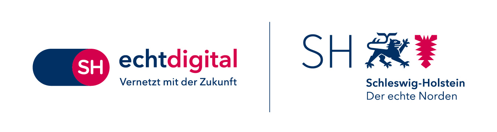

 

Ein Projekt von der [**54 Grad Software GmbH**](https://54gradsoftware.de), [**Smart City Amt Süderbrarup**](https://smartcityamtsuederbrarup.de/) und dem [**Amt Süderbrarup**](https://www.amt-suederbrarup.de/).

<a href="./Einführung/" style="
  display:inline-block;
  padding:8px 16px;
  background-color:#2b2c6a;
  color:white;
  text-decoration:none;
  border-radius:4px;">Mehr über das Projekt »
</a>

## Praxisbeispiele: Der Smarte Gemeinschaftskalender im Einsatz

Der Smarte Gemeinschaftskalender wird bereits in unterschiedlichen konexten produktiv eingesetzt. Die folgenden Instanzen zeigen exeplarisch, wie der Kalender sowohl auf kommunaler als auch auf landesweiter Ebene genutzt werden kann. 

### TAViAS – Termine, Angebote & Veranstaltungen im Amt Süderbrarup

TAViAS ist die **erste realisierte Kalenderinstanz** des Smarten Gemeinschaftskalenders. Sie richtet sich an Bürgerinnen und Bürger des **Amts Süderbrarup** und bündelt Veranstaltungen aus allen **13 amtsangehörigen Gemeinden** an einem zentralen Ort.

Ziel des digitalen Kalenders ist es, einen niedrigschwelligen Überblick über lokale Veranstaltungsangebote zu ermöglichen und gleichzeitig Vereine, Initiativen und Organisationen bei der Terminverwaltung zu entlasten. 

<a href="https://tavias.de" style="
  display:inline-block;
  padding:8px 16px;
  background-color:#2b2c6a;
  color:white;
  text-decoration:none;
  border-radius:4px;">Zur TAViAS-Instanz »
</a>

### termine.di.day – Digital Independence Day (DI.DAY)

Die KalenderInstanz termine.di.day wurde im Rahmen des Digital Idependence Day (DI.DAY) ins Leben gerufen. Der DI.DAY dezentrale Aktions- und Informationsinitiative, die dazu einläd, **digitale Alternativen zu marktbeherrschenden Big-tech-Plattformen kennenzulernen und auszuprobieren**. 

An jeden ersten Sonntag im Monat finden anlässlich des DI.DAYs Veranstaltungen, Treffen und Aktionen statt, die auf der Kalender-Instanz gebündelt und Interessierten zugänglich bereitsgestellt werden. Ziel ist es, Menschen dabei zu unterstützen, **Schritt für Schritt digitale Selbstbestimmung und Unabhängigkeit** zu erlangen – etwa durch den Wechsel zu offenen, demokratie-freundlichen digitalen Diensten (wie dem Smarten Gemeinschaftskalender).

<a href="https://termine.di.day" style="
  display:inline-block;
  padding:8px 16px;
  background-color:#2b2c6a;
  color:white;
  text-decoration:none;
  border-radius:4px;">Zur DI.DAY-Instanz »
</a>

### Landesweiter Veranstaltungskalender – „80 Jahre Schleswig-Holstein"

Anlässlich des **80-jährigen Bestehens des Landes Schleswig-Holstein** im Jahr 2026 entsteht eine landesweite Kalenderinstanz des Smarten Gemeinschaftskalenders. Sie dient als **zentraler digitaler Veranstaltungskalender** für alle Aktivitäten rund um das Jubiläumsjahr „80 Jahre Schleswig-Holstein".

Bürger*innen und Bürger, Vereine, Kommunen und Initiativen sind eingeladen, eigene Projekte und Veranstaltungen in den Kalender einzutragen. Ziel ist es, die Vielfalt der Aktionen sichtbar zu machen und **Beteiligung im ganzen Land** zu ermöglichen.  

Dieser Einsatz des Smarten Gemeinschaftskalenders zeigt, wie er sich auch für den Einsatz von zeitlich begrenzten, thematisch fokussierten Großprojekten eignet. 

<a href="https://veranstaltungen.80-jahre-sh.de" style="
  display:inline-block;
  padding:8px 16px;
  background-color:#2b2c6a;
  color:white;
  text-decoration:none;
  border-radius:4px;">Zur Jubiläums-Instanz "80 Jahre SH"  »
</a>

## Auf einen Blick – Der Smarte Gemeinschaftskalender

Der *Smarte Gemeinschaftskalender* ist eine **Open-Source-Lösung**, die darauf abzielt, die **Planung und Kommunikation von Veranstaltungen in Gemeinden und Organisationen zu optimieren**. Verschiedenste Funktionen und Automatisierungen unterstützen Veranstalter\*innen bei der Verbreitung ihrer Angebote – [Einzel](./Terminverwaltung/Einzeltermine/README.md)- und [Serientermine](./Terminverwaltung/Serientermine/README.md), [iCal-Importe](./Terminverwaltung/iCal-Dateien/README.md) oder Kalenderintegrationen.

Gleichzeitig gewährleistet die Integration unterschiedlicher **barrierearmer Kommunikationskanäle** – von Webanwendung über personalisierte [**E-Mail-Benachrichtigungen**](./DSG%20Funktionen/#E-Mail-Benachrichtigungen) und **Infotafelanbindungen** –, dass alle interessierten Bürger\*innen, **unabhängig von ihren technischen Fähigkeiten**, über aktuelle Veranstaltungen informiert werden. 

Damit trägt unser Projekt zur gesellschaftlichen Teilhabe für **alle Menschen** bei und verfolgt das Ziel der Inklusion und gelebter Diversität. 

Als offene Lösung ermöglicht unsere Softwarelösung eine [**dezentrale Vernetzung**](./Einführung/#Föderation-einzelner-Kalenderinstanzen) von Kalendern. Das bedeutet: Veranstaltungsdaten können nicht nur lokal, sondern auch (über-)regional geteilt werden.

Unsere Vision ist ein Netzwerk, durch das Bürger*innen einen umfassenden Überblick anstehender Veranstaltungen erhalten – über Gemeindegrenzen hinweg. Als positiver Nebeneffekt profitiert der regionale Tourismus und es wird ein Raum geschaffen, der zur Kollaboration zwischen Gemeinden anregt.

> **Interesse am Smarten Gemeinschaftskalender?**  
> Gemeinden, Vereine oder Organisationen, die den Smarten Gemeinschaftskalender nutzen möchten oder Ideen für neue Funktionen haben,  
> können uns unter [kontakt@54gradsoftware.de](mailto:kontakt@54gradsoftware.de) erreichen.
> Wir freuen uns auf Ihre Nachricht!

<a href="mailto:kontakt@54gradsoftware.de" style="
  display:inline-block;
  padding:8px 16px;
  background-color:#2b2c6a;
  color:white;
  text-decoration:none;
  border-radius:4px;">Jetzt Kontakt aufnehmen »
</a>

## Finanziert durch das Land

Die Entwicklung des Projekts wurde im Rahmen des [**Landesprogramms Offene Innovation der Staatskanzlei Schleswig-Holstein**](https://digitalhub.sh/de/call-for-concept-zum-landesprogramm-offene-innovation) finanziert – betreut und begleitet durch den DigitalHub.SH. 
Damit unterstützt das Land Schleswig‑Holstein **Open-Source-Projekte**, die digitale Souveränität und Innovation stärken. 

 

## Open Source & Selbst-Hosting

Der Kalender wird unter einer **Open-Source-Lizenz** veröffentlicht:  
- **Kostenfrei nutzbar** und **offen für Weiterentwicklung**  
- **Selbst hostbar** – volle Kontrolle über Daten und Anpassungen  
- **Modular erweiterbar**, um regionale Anforderungen zu erfüllen  

<a href="./Entwicklungsbereich/Hosting/" style="
  display:inline-block;
  padding:8px 16px;
  background-color:#2b2c6a;
  color:white;
  text-decoration:none;
  border-radius:4px;">Mehr über Hosting »
</a>
