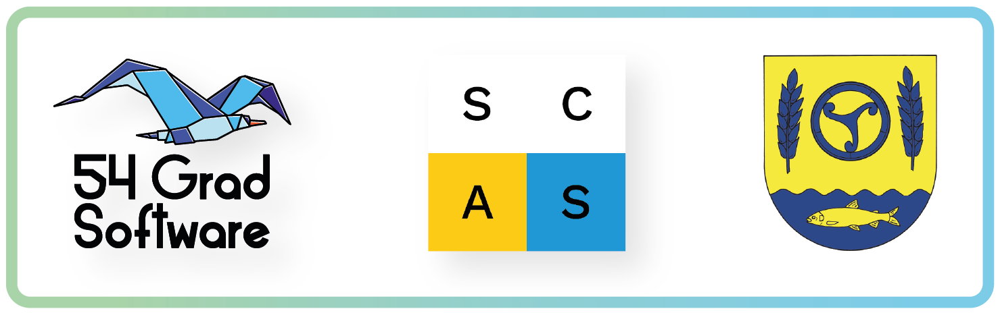

 

Ein Projekt von der [**54 Grad Software GmbH**](https://54gradsoftware.de), [**Smart City Amt Süderbrarup**](https://smartcityamtsuederbrarup.de/) und dem [**Amt Süderbrarup**](https://www.amt-suederbrarup.de/).

**Hinweis:** Der Smarte Gemeinschaftskalender befindet sich aktuell noch in der Entwicklung.

<a href="./Einführung/" style="
  display:inline-block;
  padding:8px 16px;
  background-color:#2b2c6a;
  color:white;
  text-decoration:none;
  border-radius:4px;">Mehr über das Projekt »
</a>

## Auf einen Blick – Der Smarte Gemeinschaftskalender

Der *Smarte Gemeinschaftskalender* ist eine **Open-Source-Lösung**, die darauf abzielt, die **Planung und Kommunikation von Veranstaltungen in Gemeinden und Organisationen zu optimieren**. Verschiedenste Funktionen und Automatisierungen unterstützen Veranstalter\*innen bei der Verbreitung ihrer Angebote – [Einzel](./Terminverwaltung/Einzeltermine/README.md)- und [Serientermine](./Terminverwaltung/Serientermine/README.md), [iCal-Importe](./Terminverwaltung/iCal-Dateien/README.md) oder Kalenderintegrationen.

Gleichzeitig gewährleistet die Integration unterschiedlicher **barrierearmer Kommunikationskanäle** – von Webanwendung über personalisierte [**E-Mail-Benachrichtigungen**](./DSG%20Funktionen/#E-Mail-Benachrichtigungen) und **Infotafelanbindungen** –, dass alle interessierten Bürger\*innen, **unabhängig von ihren technischen Fähigkeiten**, über aktuelle Veranstaltungen informiert werden. 

Damit trägt unser Projekt zur gesellschaftlichen Teilhabe für **alle Menschen** bei und verfolgt das Ziel der Inklusion und gelebter Diversität. 

Als offene Lösung ermöglicht unsere Softwarelösung eine [**dezentrale Vernetzung**](./Einführung/#Föderation-einzelner-Kalenderinstanzen) von Kalendern. Das bedeutet: Veranstaltungsdaten können nicht nur lokal, sondern auch (über-)regional geteilt werden.

Unsere Vision ist ein Netzwerk, durch das Bürger*innen einen umfassenden Überblick anstehender Veranstaltungen erhalten – über Gemeindegrenzen hinweg. Als positiver Nebeneffekt profitiert der regionale Tourismus und es wird ein Raum geschaffen, der zur Kollaboration zwischen Gemeinden anregt.

> **Interesse am Smarten Gemeinschaftskalender?**  
> Gemeinden, Vereine oder Organisationen, die den DSG nutzen möchten oder Ideen für neue Funktionen haben,  
> können uns unter [kontakt@54gradsoftware.de](mailto:kontakt@54gradsoftware.de) erreichen.
> Wir freuen uns auf Ihre Nachricht!

<a href="mailto:kontakt@54gradsoftware.de" style="
  display:inline-block;
  padding:8px 16px;
  background-color:#2b2c6a;
  color:white;
  text-decoration:none;
  border-radius:4px;">Jetzt Kontakt aufnehmen »
</a>

## Gefördert durch das Land

Dieses Projekt wird im Rahmen des [**Landesprogramms Offene Innovation**](https://digitalhub.sh/de/call-for-concept-zum-landesprogramm-offene-innovation)  
durch den **DigitalHub.SH** gefördert.  
Damit unterstützt das Land Schleswig‑Holstein **Open-Source-Projekte**, die digitale Souveränität und Innovation stärken.

## Open Source & Selbst-Hosting

Der Kalender wird unter einer **Open-Source-Lizenz** veröffentlicht:  
- **Kostenfrei nutzbar** und **offen für Weiterentwicklung**  
- **Selbst hostbar** – volle Kontrolle über Daten und Anpassungen  
- **Modular erweiterbar**, um regionale Anforderungen zu erfüllen  

<a href="./Entwicklungsbereich/Hosting/" style="
  display:inline-block;
  padding:8px 16px;
  background-color:#2b2c6a;
  color:white;
  text-decoration:none;
  border-radius:4px;">Mehr über Hosting »
</a>
