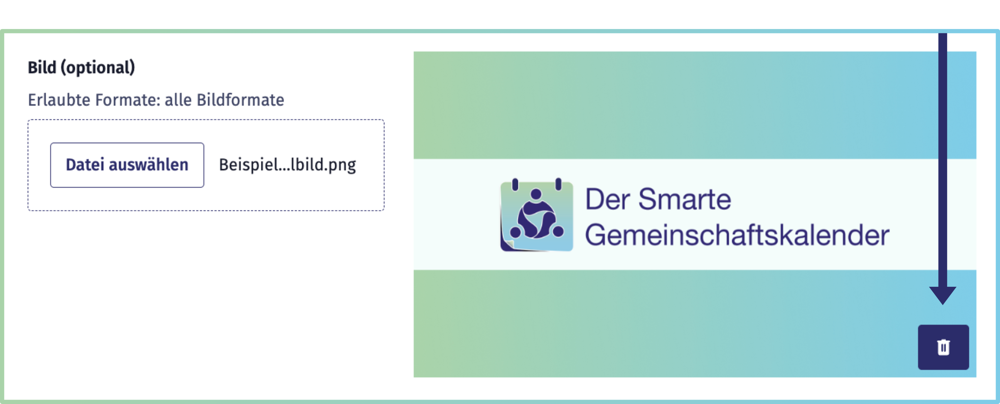

[« Zurück](/get-started)

# Einzeltermine

Einzeltermine können Sie direkt im **Smarten Gemeinschaftskalender** anlegen und verwalten. Sie eignen sich besonders für **einmalige Veranstaltungen** oder **Veranstaltungen ohne festen Rhythmus**.

Im Seitenmenü der Terminverwaltung unter der Rubrik **Einzeltermine** können Sie:
* Neue Einzeltermine **anlegen**
* Termine **duplizieren**, um ähnliche Veranstaltungen schnell anlegen zu können
* Bestehende Einzeltermine **bearbeiten** 
* Den **Veranstaltungsstatus aktualisieren**

Diese Dokumentation führt Sie **Schritt für Schritt** durch den gesamten Prozess – von der Erstellung bis zur Aktualisierung Ihrer Einzeltermine.

## Einzeltermine erstellen

Um einen neuen Einzeltermin zu erstellen, klicken Sie auf den Button *+ Einzeltermin anlegen* (oben rechts).

Es öffnet sich ein Formular. Hier können Sie nachlesen, wie Sie die Eingabefelder am besten nutzen.

### Titel
Der Titel ist das, was potenzielle Teilnehmer*innen als erstes von Ihrer Veranstaltung sehen. Geben Sie daher einen aussagekräftigen Namen an, der Thema und Art der Veranstaltung deutlich macht.

**Hinweis:** Halten Sie den Titel so kurz wie möglich, aber so lang wie nötig, damit er in Übersichten gut lesbar bleibt und gleichzeitig Interesse weckt.

### Bild

Ein Veranstaltungsbild kann die Art und den Charakter Ihrer Veranstaltung **visuell hervorheben**. Es wird sowohl als Vorschaubild auf der Kalenderstartseite und in den Suchergebnissen als auch auf der Detailseite der jeweiligen Veranstaltung angezeigt.  
Wenn Sie kein Bild hochladen, wird automatisch der **Standard-Farbverlauf des Smarten Gemeinschaftskalenders** hinterlegt.

Klicken Sie auf das Feld *Datei auswählen*, um in Ihren Ordnern das gewünschte Bild auszuwählen, oder ziehen Sie es per **Drag & Drop** direkt in das Eingabefeld.  

**Empfehlungen für das Bild:**  
- Wählen Sie ein **aussagekräftiges Motiv** im **Querformat**.  
- Verzichten Sie auf kleine Schriften, da diese insbesondere in der Vorschau schlecht lesbar sind.  
- Verwenden Sie das Bild nicht für Detailinformationen – diese gehören in die Veranstaltungsbeschreibung.  

Nach dem Hochladen erscheint eine **Vorschau** rechts neben dem Eingabefeld.  
- Um das Bild zu ersetzen, laden Sie einfach ein neues hoch.  
- Mit dem **Löschen-Button** in der Vorschau können Sie das aktuelle Bild jederzeit entfernen.

### Beschreibung

Fügen Sie hier detaillierte Informationen zu Ihrem Termin hinzu, die für Teilnehmende wichtig sind, z. B.:
* Anmeldeprozess (ist eine Anmeldung nötig und Preise)
* Ablauf und Inhalte
* Zielgruppe (Alter, Vorkenntnisse)
* Voraussetzungen oder mitzubringende Ausstattungen
* weitere veranstaltungsspezifische Details

**Hinweis:** Halten Sie die Beschreibung übersichtlich strukturiert und leicht verständlich, damit Sie den Teilnehmer*innen hilft, sich ein genaues Bild vom Termin zu machen.

### Zeitraum festlegen

Legen Sie fest, **wann** und **wie lange** Ihr Einzeltermin stattfindet.

**Startdatum:** Wählen Sie den Tag, an dem der Termin stattfinden soll.

**Beginn (Uhrzeit):** Geben Sie an, zu welcher Uhrzeit der Termin startet. Im ersten Feld geben Sie die Stunde (00 - 23) und im zweiten Feld die Minuten (00-59) an.

**Dauer:** Ausgehend von dem Startzeitpunkt legen Sie mit der Dauer fest, wie lange Ihre Veranstaltung stattfindet. Geben Sie bitte die Anzahl der Stunden und Minuten an und **keine Uhrzeit**.

### Organisation

Da Sie Teil mehrerer Organisationen sein können, wird Ihnen an dieser Stelle die Organisation angezeigt, für die Sie gerade den Einzeltermin anlegen. Sie können die Organisation im Formular nicht bearbeiten – sie wird Ihnen ausgegraut angezeigt. 

Sollten Sie sich in der falschen Organisationsoberfläche befinden, können Sie diese oben im Seitenmenü unkompliziert wechseln.

 

### Kategorien

Beim Anlegen Ihrer Veranstaltung können Sie eine von insgesamt 30 Kategorien wählen. Entscheiden Sie sich dabei für die Kategorie, die am ehesten zu der Art und den Inhalten der Veranstaltung passt. 

Behalten Sie dabei im Hinterkopf: Menschen können sowohl in der Suche als auch beim Abonnieren von Veranstaltungsbenachrichtigungen nach Kategorien filtern. Dieser Schritt ist daher von besonderer Wichtigkeit, damit die richtigen Personen von Ihrer Veranstaltung erfahren.

Um in der Kalenderansicht die Kategorien farblich unterscheiden zu können, werden die 30 Kategorien zu 5 Oberkategorien zusammengefasst. Ihre Veranstaltung wird entsprechend automatisch zugeordnet.

 

Konkret setzen sich die Kategorien folgendermaßen zusammen:
* **Kultur & Kreatives:** Darstellende & bildende Kunst, Film & Medien, Theater, Sprache & Kultur, Fotografie, Musik, Kunsthandwerk, Kabarett, Kunst
* **Gemeinschaft & Engagement:** Ehrenamt, LGBTQIA+, Netzwerke, Gesellschaft & Politik, “Glauben, Religion & Spiritualität”, Lesekreise, Treffen, Benefiz & Spendenaktionen, Familie, Gemeinschaft & Ehrenamt
* **Familie & Freizeit:** Natur & Abenteuer, Tiere & Haustiere, Tanzen & Feiern, Mode & Schönheit, Spiele & Gaming, “Autos, Boote, Luftfahrt”, Essen & Trinken
* **Gesundheit & Bewegung:** Gesundheit, Sport
* **Wirtschaft & Bildung:** Wissenschaft & Technologie, Bildung, Wirtschaft & Unternehmen

### Beitrittsoptionen

Bei den Beitrittsoptionen haben Sie zwei Auswahlmöglichkeiten:
1. Kostenlos
2. Extern

### Sprache

Wählen Sie die Sprache aus, mit der die Veranstaltung primär durchgeführt wird.

### Status
Sie haben die Möglichkeit zwischen drei Statusoptionen zu wählen:

**1. Bestätigt:** Mit dieser Standardoption veröffentlichen Sie einen Termin, welcher gesichert zu dem festgelegten Termin stattfinden soll.

**2. Vorläufig:** Wenn Sie eine Veranstaltung bereits bekannt geben möchten, aber nicht gesichert ist, dass diese stattfinden kann oder beispielsweise der Zeitpunkt unklar ist, vergeben Sie den Status *Vorläufig*. Schreiben Sie am besten in der Beschreibung etwas zu dem *Grund für den Vorläufig-Status*!

**3. Abgesagt:** Dieser Status wird gewählt, wenn eine Veranstaltung abgesagt werden muss. In der Regel spielt diese Option beim Anlegen einer Veranstaltung keine Rolle. Findet eine Veranstaltung nicht mehr statt, kann der Status jederzeit im Nachhinein angepasst werden. 

### Webseite verlinken
Wenn Sie eine Webseite mit weiteren relevanten Veranstaltungsinformationen bereitstellen möchten oder auf eine externe Anmeldeplattform verlinken möchten, können Sie hier eine URL (Link zur Webseite) eingeben. 

### Adresse und Kartenansicht

Im Feld *Adresse* geben Sie den Veranstaltungsort ein: *Straße, Hausnummer, Postleitzahl und Stadt*. 

Die Karte aktualisiert sich automatisch entsprechend der angegebenen Adresse. Interessierte und Teilnehmer*innen können auf der Veranstaltungsseite zusätzlich zur Adresse die Kartenansicht zur Orientierung nutzen.

Steht der Veranstaltungsort noch nicht fest, kann dieses Feld leer gelassen werden. In diesem Fall empfiehlt sich ein Hinweis in der Beschreibung, dass diese Information folgen wird.  

Auch bei Online-Veranstaltungen können Sie dieses Feld einfach leer lassen. Erläutern Sie ebenfalls in der Beschreibung, wie an der Veranstaltung teilgenommen werden kann – beispielsweise über einen Link zu einer Online-Konferenz.

## Einzeltermine duplizieren

Wenn Sie bereits Einzeltermine angelegt haben und einen ähnlichen weiteren Termin anlegen wollen, haben Sie die Möglichkeit, einen bestehenden Termin zu duplizieren. 

In der Rubrik Einzeltermine verwalten finden Sie eine Übersicht aller angelegten Einzeltermine. Suchen Sie die Veranstaltung, die Sie als Vorlage nutzen möchten und klicken in der jeweiligen Zeile den Button mit dem *Duplizieren-Symbol*.

Es öffnet sich das vorausgefüllte Formular, welches Sie nach Bedarf anpassen können. Anschließend veröffentlichen Sie über den Button *Einzeltermin anlegen* Ihre Veranstaltung.

## Einzeltermine bearbeiten

Sie können bestehende Einzeltermine auf zwei Wegen bearbeiten:

**1. Über die Terminverwaltung:**
Wechseln Sie in der Seitenleiste zur *Rubrik Einzeltermine*. In der dort angezeigten Tabelle finden Sie eine Übersicht aller angelegten Einzeltermine. Um einen Termin zu bearbeiten, klicken Sie einfach auf das Stift-Symbol in der entsprechenden Tabellenzeile.

**2. Direkt über die Veranstaltungsseite:**
Wenn Sie in Ihrem Benutzerkonto eingeloggt sind, können Sie eine Veranstaltung auch direkt aus der Einzelansicht eines Termins heraus bearbeiten. Klicken Sie dazu in der rechten unteren Ecke des Seiten-Headers auf das Bearbeiten-Symbol.

In beiden Fällen öffnet sich das bereits vorausgefüllte *Bearbeitungsformular*, in dem Sie einzelne Angaben anpassen und anschließend aktualisieren können. 

Wenn Sie alle gewünschten Änderungen vorgenommen haben, speichern Sie diese über den Button am Ende des Formulars. 

### Status ändern
**Hinweis:** Die Inhalte zu diesem Bereich werden zeitnah ergänzt.

## Einzeltermin löschen

**Hinweis:** Die Inhalte zu diesem Bereich werden zeitnah ergänzt.
