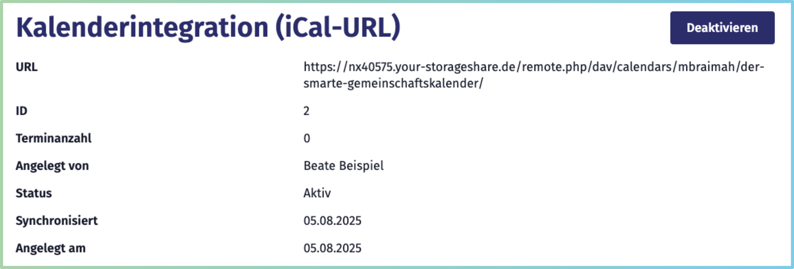

[« Zurück](/get-started)

# Kalenderintegration mit iCal-URLs

Die **Kalenderintegration per iCal-URL** ermöglicht es Ihnen, Termine aus einem externen Kalender (z. B. digitale Vereinskalender) **dauerhaft und automatisch** in den *Smarten Gemeinschaftskalender* zu übernehmen.  
Im Gegensatz zum einmaligen Import einer [iCal-Datei](/Terminverwaltung/iCal-Dateien/) bleibt die Integration dauerhaft bestehen – **Änderungen im Quellkalender werden automatisch synchronisiert**.  

Eine iCal-URL ist ein **privater Kalenderlink**, der in nahezu allen gängigen Systemen erstellt werden kann, z. B.:
- **Google Kalender**
- **Nextcloud**
- **Apple Kalender**
- **Microsoft Outlook**
- und viele weitere.

Diese Funktion eignet sich besonders, wenn:  
- alle Termine eines **Vereins- oder Organisationskalenders** kontinuierlich im *Smarten Gemeinschaftskalender* angezeigt werden sollen.  
- Sie einen **gepflegten und aktuellen Kalender** betreiben.
- eine Doppelpflege zweier Kalender vermieden werden soll. So verhindern Sie zudem, dass sich bei der manuellen Terminübertragung Fehler einschleichen.  

Im Seitenmenü der Terminverwaltung unter der Rubrik **Kalenderintegration** können Sie:  
- Neue Kalender per [iCal-URL anbinden](#kalender-integrieren-ical-url-anbinden) 
- Bestehende Integrationen verwalten  
- Kalender vorübergehend deaktivieren.

Diese Dokumentation führt Sie Schritt für Schritt durch den Prozess der Integration.

## Kalender integrieren: iCal-URL anbinden

Um einen Kalender anzubinden, öffnen Sie in der Terminverwaltung den Bereich **Kalenderintegration**. Dort klicken Sie auf den Button **+ iCal-URL**, um das Formular aufzurufen. Hier fügen Sie die **URL Ihres externen Kalenders** ein. 
   > Diese finden Sie in der Regel in den Freigabeeinstellungen Ihres Kalenders (z. B. **Abonnement-Link** oder **„iCal-Link“**).  Weitere Informationen finden Sie in der Hilfe Ihres jeweiligen Kalendersystems.  

Alle Veranstaltungsinformationen (z. B. **Titel, Datum, Uhrzeit und Beschreibung**) werden automatisch aus Ihrem Quellkalender übernommen. So vermeiden Sie Übertragungsfehler, die bei einer manuellen Eingabe häufig auftreten können. Die Felder  **Titel, Datum, Uhrzeit** sind daher in dem Formular nicht vorhanden.

Neben der URL können Sie zusätzliche Angaben machen. Beachten Sie jedoch, dass alle Angaben, die Sie im Formular eintragen (z. B. **Kategorie**, **Anmeldeoptionen**, **Sprache**, etc.), **für alle hochgeladenen Termine** gelten. Sie können jedoch einzelne Termine im Nachgang individuell anpassen und **bearbeiten**.  

Eine Besonderheit ist die **Beschreibung** – sie wird angezeigt, falls ein Termin im Quellkalender keine eigene Beschreibung enthält. Bestehende Beschreibungen aus dem Quellkalender werden nicht überschrieben. 

Detailinformationen zu den Eingabefeldern können im Bereich der Einzeltermine eingesehen werden, da diese analog funktionieren:

- [Beschreibung](/Terminverwaltung/Einzeltermine/#beschreibung)
- [Organisation](/Terminverwaltung/Einzeltermine/#organisation)
- [Kategorien](/Terminverwaltung/Einzeltermine/#kategorien)
- [Beitrittsoptionen](/Terminverwaltung/Einzeltermine/#beitrittsoptionen)
- [Sprache](/Terminverwaltung/Einzeltermine/#sprache)
- [Status](/Terminverwaltung/Einzeltermine/#status)
- [Webseite verlinken](/Terminverwaltung/Einzeltermine/#webseite-verlinken)
- [Adresse und Kartenansicht](/Terminverwaltung/Einzeltermine/#adresse-und-kartenansicht)
- **Organisation, Kategorien, Sprache, Status usw.:** Diese Felder funktionieren identisch wie beim [Einzeltermin](/Terminverwaltung/Einzeltermine/).  
- **Adresse und Kartenansicht:** Falls gewünscht, können Sie eine Standardadresse für alle Termine der Integration hinterlegen.

Nachdem Sie die iCal-URL und alle gewünschten Angaben ergänzt haben, klicken Sie auf **+ Kalender integrieren**. Die Integration wird nun erstellt und automatisch aktiviert. 

In der Übersichtstabelle im Bereich **Terminverwaltung** unter dem Reiter **Kalenderintegration** erscheint nun ihre iCal-URL als neuer Tabelleneintrag. Hier sehen Sie unter anderem:
- **die URL** der Integration,
- **den Status** aktiv oder inaktiv,
- **die Anzahl der Termine**, die aktuell über diese Integration übernommen wurden
- und den **Zeitpunkt der letzten Synchronisation**.

## Integration aktivieren und deaktivieren

Sie können die Kalenderintegrationen jederzeit aktivieren oder deaktivieren:  
- **Deaktivieren:** Stoppt die Synchronisation neuer Termine. Bereits eingepflegte Termine bleiben im *Smarten Gemeinschaftskalender* bestehen.   
- **Aktivieren:**  Startet die Synchronisation und führt neue Termine dem *Smarten Gemeinschaftskalender** hinzu.

Zum Ändern des Status klicken Sie im Bereich **Kalenderintegration** der Terminverwaltung auf "Ansehen" der jeweiligen Integration in der Tabelle. So gelangen Sie zur Detailansicht. Oben rechts befindet sich ein Button zum Aktivieren oder Deaktivieren Ihrer Integration. 

## Termine der Kalenderintegration bearbeiten

Jede Veranstaltung, die über die Kalenderintegration hinzugefügt wird, kann nachträglich **individuell bearbeitet** werden. Änderungen wirken sich dabei nur auf den ausgewählten Termin aus – andere Veranstaltungen der Integration bleiben unverändert.

Dafür stehen Ihnen zwei Wege zur Verfügung:

1. **Über die Einzelansicht:**  
   Wenn Sie im öffentlichen Bereich eine einzelne Veranstaltung öffnen und eingeloggt sind, erscheint im Headerbereich rechts unten das **Bearbeiten-Symbol**.
    

2. **Über die Terminverwaltung:**  
   In der Rubrik **Kalenderintegration** finden Sie eine Übersicht aller Kalenderintegrationen.
  
     Wählen Sie die entsprechende Integration in der Tabelle aus, um zur **Detailansicht** zu gelangen, wo Sie eine Übersicht aller übernommenen Termine finden. Klicken Sie auf das **Bearbeiten-Symbol** in der jeweiligen Terminzeile, um den Termin anzupassen.

Sie gelangen jeweils in die Bearbeiten-Ansicht für Einzeltermine. Die Änderungen werden ausschließlich für den ausgewählten Termin übernommen – nicht für die gesamte Kalenderintegration. Die Änderungen übernehmen Sie, indem Sie am Ende des Formulars auf den Button **Änderungen speichern** klicken.  

Die Integration als Ganzes kann nicht bearbeitet werden. 