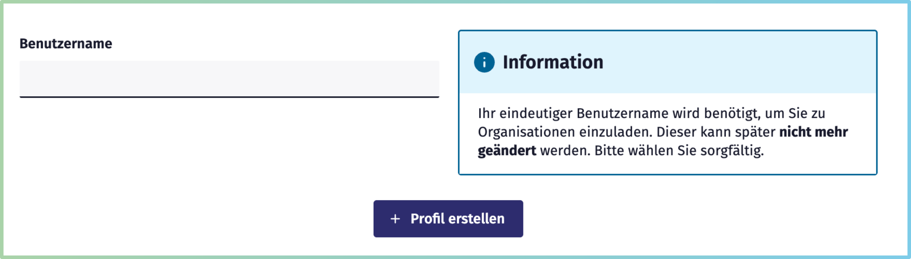

[« Zurück](/get-started)

# Organisationsverwaltung

Um Veranstaltungen im *Smarten Gemeinschaftskalender* anzulegen oder zu verwalten, benötigen Sie zunächst ein **persönliches Profil**.  
Mit diesem Profil können Sie entweder:

* eine **eigene Organisation erstellen**, oder  
* sich von einer bestehenden Organisation **einladen lassen**.  

Organisationen sind die zentrale Einheit im Kalender: Sie bündeln die Veranstaltungen eines Vereins, einer Initiative oder einer Institution und machen diese für Bürger*/innen sichtbar. Mehrere Benutzer*innen können Termine einer Organisation verwalten. 

In diesem Dokumentationsbereich erfahren Sie Schritt für Schritt,  
- wie Sie Ihr Profil erstellen,  
- wie Sie eine Organisation anlegen und Mitglieder hinzufügen,  
- und wie Sie Mitglieder, Rollen und Organisationsdaten verwalten.  

## Registrierung für Einzelpersonen bzw. Organisationsmitglieder

Um im *Smarten Gemeinschaftskalender* mitarbeiten oder Veranstaltungen verwalten zu können, benötigen Sie zunächst ein **persönliches Profil**.  

### Registrierung
1. Klicken Sie in der Top-Navigation auf **Intern**.  
2. Wählen Sie **Jetzt registrieren**.  
3. Geben Sie Ihre **E-Mail-Adresse** ein. Wählen Sie zudem ein sicheres **Passwort** und bestätätigen Sie das Passwort mit einer erneuten Eingabe. 
4. Klicken Sie auf *Jetzt registrieren*. Ihr Konto wurde nun erstellt. Nach erfolgreicher Registrierung erhalten Sie eine Bestätigungsmeldung im Browser.

### E-Mail bestätigen
Bitte öffnen Sie nun die E-Mail, die Sie vom System erhalten haben, und klicken Sie auf den Bestätigungslink.  
Anschließend werden Sie automatisch zur **Login-Seite** weitergeleitet.  

### Profil erstellen
Nach dem Login legen Sie Ihren **Benutzernamen** fest.  
- Der Benutzername dient der **Identifikation** und wird auch anderen Nutzer*innen angezeigt.  
- **Wichtig:** Er kann später **nicht mehr geändert** werden.  
- In vielen Fällen empfiehlt es sich, einen **personenbezogenen Namen** zu wählen, z. B. *vorname_nachname*.  
- Wenn keine direkte Namensnennung gewünscht ist, können Sie natürlich auch einen anderen eindeutigen Namen verwenden.  

Klicken Sie anschließend auf **Profil erstellen**. Ihr persönliches Profil ist nun aktiv.  

### Nächste Schritte
Nachdem Ihr Profil angelegt ist, haben Sie zwei Möglichkeiten:  
- Sie können Ihren **Benutzernamen an eine Organisation weitergeben**, um dort eingeladen zu werden ([siehe Mitglieder hinzufügen](./#mitglieder-hinzufugen)).  
- Oder Sie legen selbst eine **eigene Organisation an** ([siehe Organisation erstellen](./#organisation-erstellen-zugang-fur-veranstalter-innen)).  

## Organisation erstellen: Zugang für Veranstalter*innen
**Hinweis:** Die Inhalte zu diesem Bereich werden zeitnah ergänzt.

## Profil- und Organisationsverwaltung

**Hinweis:** Die Inhalte zu diesem Bereich werden zeitnah ergänzt.

## Organisationsadministration

### Mitglieder hinzufügen 