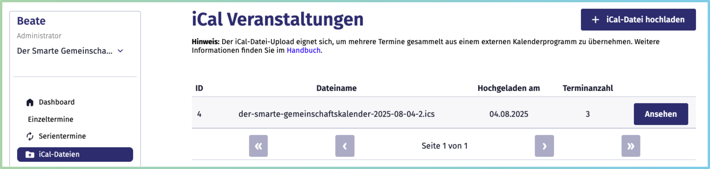
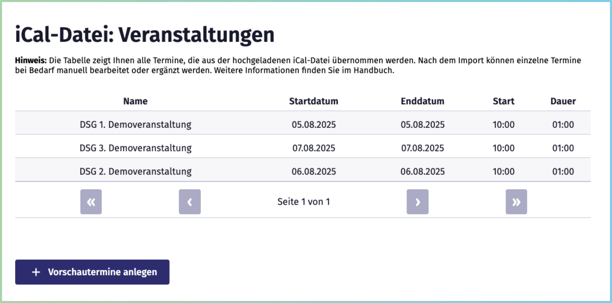
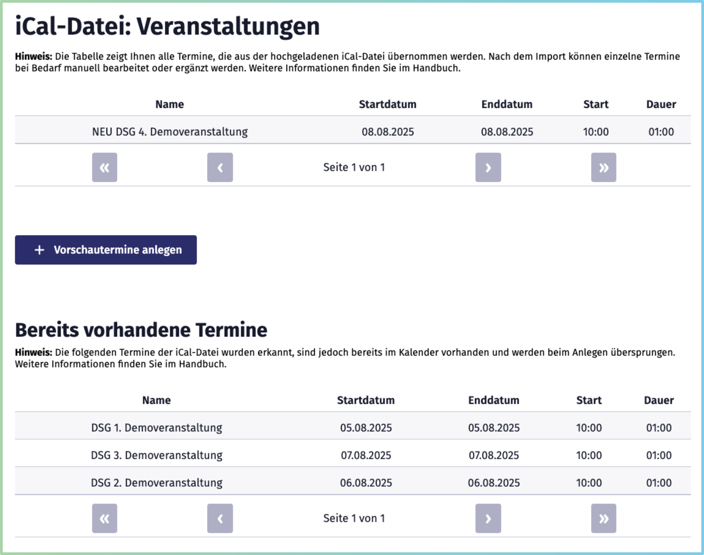
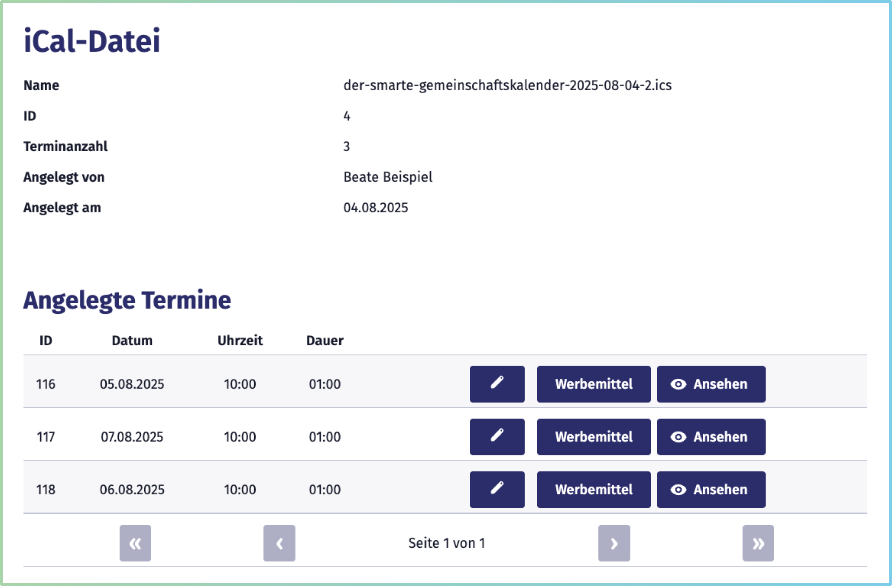

[« Zurück](/get-started)

# iCal-Dateien

Eine **.ics-Datei** ist ein universelles Kalenderformat, das von nahezu allen gängigen Kalenderprogrammen unterstützt wird, z. B.:
- **Google Kalender**
- **Apple Kalender**
- **Microsoft Outlook**
- und viele weitere.

Sie können iCal-Dateien beispielsweise aus Ihrem persönlichen digitalen Kalender exportieren. Dabei können **einzelne Termine** sowie ganze Kalender mit einer **Terminsammlung** exportiert werden. 

iCal-Dateien eignen sich, um **einzelne oder mehrere Veranstaltungen auf einmal** in den *Smarten Gemeinschaftskalender* zu importieren, die bereits an anderer Stelle eingepflegt wurden – schnell, effizient und ohne manuelle Flüchtigkeitsfehler.  
Im Gegensatz zu Einzel- oder Serienterminen laden Sie eine vorbereitete **iCal-Datei (.ics)** mit den entsprechenden Veranstaltungsdaten hoch und vermeiden das händische Abschreiben von Termindaten.  

Diese Funktion eignet sich besonders, wenn:  
- **Einzelne Termine** komfortabel aus einem anderen Kalender übernommen werden sollen.  
- **Bereits in einem anderen Kalender angelegte Terminserien oder -sammlungen** exportiert und in den *Smarten Gemeinschaftskalender* importiert werden.  

*Hinweis:* Wenn Termine eines bestimmten Kalenders langfristig und aktuell im *Smarten Gemeinschaftskalender* erscheinen sollen, empfiehlt sich stattdessen die **[Kalenderintegration per iCal-URL](/Terminverwaltung/Kalenderintegration/)** mit **dauerhafter Synchronisierung**.  

Im Seitenmenü der Terminverwaltung unter der Rubrik **iCal-Dateien** können Sie:  
- Neue Veranstaltungen per [iCal-Datei importieren](#ical-datei-hochladen) und gemeinsame Angaben für alle Termine festlegen  
- Einzelne Termine der hochgeladenen Dateien [bearbeiten](#hochgeladene-ical-termine-bearbeiten).

Diese Dokumentation führt Sie Schritt für Schritt durch diese Prozesse.

## iCal-Datei hochladen

Um eine iCal-Datei hochzuladen, öffnen Sie in der Terminverwaltung den Bereich **iCal-Dateien**. Über den Button **iCal-Datei hochladen** rufen Sie das entsprechende Formular auf.

Hier können Sie eine vorbereitete **.ics-Datei** entweder über die Schaltfläche **Datei auswählen** hochladen oder sie per **Drag & Drop** direkt in das Feld zum Hochladen ziehen. 

Alle Veranstaltungsinformationen (z. B. **Titel, Datum, Uhrzeit und Beschreibung**) werden automatisch aus der Datei übernommen. So vermeiden Sie Übertragungsfehler, die bei einer manuellen Eingabe häufig auftreten können. Die Felder **Titel, Datum, Uhrzeit** sind daher in dem Formular nicht vorhanden.

Die **Beschreibung** bildet eine Ausnahme: Sie können eine einheitliche Beschreibung angeben. Diese wird ausschließlich für Veranstaltungen übernommen, die keinen Beschreibungstext in der iCal-Datei hinterlegt haben. 

Darüber hinaus können Sie zusätzliche Angaben für Ihre iCal-Datei-Termine im Formular machen. Beachten Sie jedoch, dass alle Angaben, die Sie im Formular eintragen (z. B. **Kategorie**, **Anmeldeoptionen**, **Sprache**, usw.), **für alle hochgeladenen Termine** gelten. Sie können diese jedoch nach dem Anlegen **individuell anpassen** und die einzelnen Termine **bearbeiten**.

Detailinformationen zu den Eingabefeldern können im Bereich der Einzeltermine eingesehen werden, da diese analog funktionieren:

- [Beschreibung](/Terminverwaltung/Einzeltermine/#beschreibung)
- [Organisation](/Terminverwaltung/Einzeltermine/#organisation)
- [Kategorien](/Terminverwaltung/Einzeltermine/#kategorien)
- [Beitrittsoptionen](/Terminverwaltung/Einzeltermine/#beitrittsoptionen)
- [Sprache](/Terminverwaltung/Einzeltermine/#sprache)
- [Status](/Terminverwaltung/Einzeltermine/#status)
- [Webseite verlinken](/Terminverwaltung/Einzeltermine/#webseite-verlinken)
- [Adresse und Kartenansicht](/Terminverwaltung/Einzeltermine/#adresse-und-kartenansicht)

Nachdem Sie die Datei hochgeladen und die gewünschten Angaben ergänzt haben, klicken Sie auf **„Veranstaltungen anzeigen“**.  
Es öffnet sich eine **Übersichtstabelle**, in der alle Termine der iCal-Datei aufgelistet sind. 

 

Prüfen Sie die Angaben und klicken Sie anschließend auf **Vorschautermine anlegen**, um die Veranstaltungen im *Smarten Gemeinschaftskalender* zu speichern.

### Bereits vorhandene Termine
Wenn Termine der iCal-Datei bereits im Kalendersystem hinterlegt sind, werden diese in einer separaten Tabelle ausgewiesen. Nur tatsächlich neue Termine können hochgeladen werden. 

 

## Hochgeladene iCal-Termine bearbeiten

Jede Veranstaltung, die über eine iCal-Datei hochgeladen wurde, kann nachträglich **individuell bearbeitet** werden. Änderungen wirken sich dabei nur auf den ausgewählten Termin aus – andere Veranstaltungen aus derselben Datei bleiben unverändert.

Dafür stehen Ihnen zwei Wege zur Verfügung:

1. **Über die Einzelansicht:**  
   Wenn Sie im öffentlichen Bereich eine einzelne Veranstaltung öffnen und eingeloggt sind, erscheint im Headerbereich rechts unten das **Bearbeiten-Symbol**.
    

2. **Über die Terminverwaltung:**  
   In der Rubrik **iCal-Dateien** finden Sie eine Übersicht aller hochgeladenen iCal-Dateien.  
  
    
     Wählen Sie die entsprechende Datei aus – so gelangen Sie zur **Tabelle aller darin enthaltenen Veranstaltungen**.  
   
   Klicken Sie auf das **Bearbeiten-Symbol** in der jeweiligen Terminzeile, um den Termin anzupassen.

Sie gelangen jeweils in die Bearbeiten-Ansicht für Einzeltermine. Die Änderungen werden ausschließlich für den ausgewählten Termin übernommen – nicht für die gesamte Datei. Die Änderungen übernehmen Sie, indem Sie am Ende des Formulars auf den Button **Änderungen speichern** klicken.  

Eine iCal-Datei als Ganzes kann nicht bearbeitet werden. 