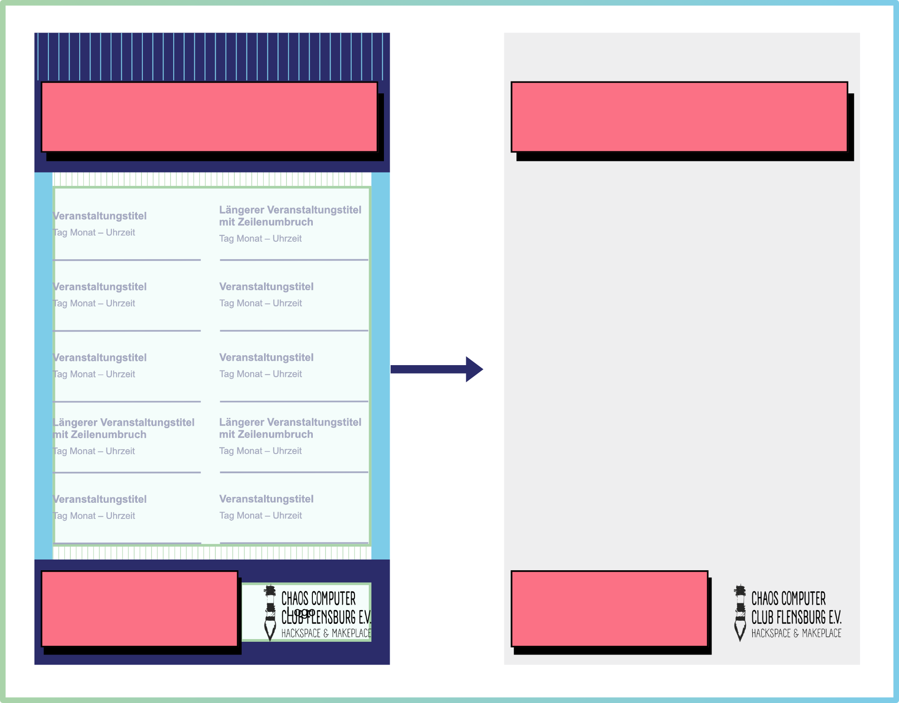
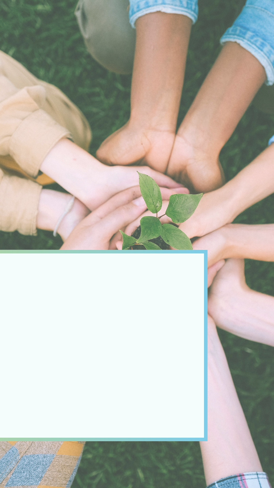

[« Zurück](/get-started)
# Werbemittelgenerator
Mit dem Werbemittelgenerator können Sie visuelle Ankündigungen für Ihre Veranstaltungen erstellen – ideal zum Teilen in den sozialen Medien und auf digitalen Anzeigen. Dies ist nicht nur ein effizienter Weg, Werbemittel zu erstellen, durch die direkte Übernahme der Veranstaltungsinformationen vermeiden Sie auch Fehlerquellen bei der Informationsübertragung.

Dieser Dokumentationsbereich führt Sie Schritt für Schritt durch die Funktionen und Gestaltungsmöglichkeiten.

**Die Anleitung ist in folgende Abschnitte gegliedert:**

* Finden Sie Informationen zur [Bedienung des Werbemittelgenerators](#bedienung-des-werbemittelgenerators) – je nachdem, ob Sie eine **Übersicht mehrerer Veranstaltungen** oder eine **Ankündigung für eine einzelne Veranstaltung** gestalten möchten. 

* Im Abschnitt [Hintergrunderstellung](#richtlinien-fur-die-hintergrunderstellung) finden Sie die **Richtlinien**, um passgenaue Hintergründe für die jeweiligen Formate erstellen zu können. 

* Wenn Sie keine eigenen Hintergründe gestalten möchten, können Sie zudem im Abschnitt [Gebrauchsfertige Hintergründe](#gebrauchsfertige-hintergrunde-zum-herunterladen) verschiedene Vorlagen zur freien Verfügung herunterladen.

* Im [Markenkit](#markenkit) haben Sie die Möglichkeit Farben, Schriften und Hintergründe Ihrer Organisation zu hinterlegen, um diese dauerhaft **wiederverwenden** zu können.

* Für **inklusive Werbemittel** sollte zudem unbedingt auf [barrierefreie Gestaltungsprinzipien](/Barrierefreiheit/#gestaltungsprinzipien-fur-barrierefreie-inhalte) geachtet werden.

## Bedienung des Werbemittelgenerators

Für den Werbemittelgenerator gibt es **zwei Anwendungsfälle:**

Sie können entweder eine [Veranstaltungsübersicht](./#werbemittelgenerator-fur-veranstaltungsubersichten) mit mehreren anstehenden Terminen oder eine [Ankündigung für eine einzelne Veranstaltung](./#werbemittelgenerator-fur-ankundigungen-einzelner-veranstaltungen) erstellen.

Das Aufrufen der jeweiligen Generatoren und deren Aufbau unterscheidet sich leicht. 

### Werbemittelgenerator für Veranstaltungsübersichten

Mit dem **Werbemittelgenerator für Veranstaltungsübersichten** können Sie bis zu **10 anstehende Veranstaltungen** Ihrer Organisation für einen frei wählbaren Zeitraum in einer Übersicht darstellen. Veranstaltungsinformationen werden automatisch aus dem *Smarten Gemeinschaftskalender* geladen und in einem standardisierten Format Ihrer Wahl angezeigt. 

#### Zugriff auf den Generator

1. **Öffnen Sie den Verwaltungsbereich** über den Button *Veröffentlichen* in der oberen Navigationsleiste des Kalenders.  
2. Wenn Sie mehrere Organisationen betreuen, achten Sie darauf, dass oben in der linken Menüleiste die **Organisation** ausgewählt ist, für die Sie die Veranstaltungsübersicht erstellen möchten (per Drop-Down-Pfeil änderbar).  
3. Navigieren Sie zum **Menüpunkt Werbemittel** und öffnen den Generator für **Veranstaltungsübersichten**.

#### Einstellungen und Funktionen
Der Generator bietet verschiedene Optionen, um Ihre Übersicht individuell zu gestalten. Sofern Designvorgaben Ihrer Organisation im [Markenkit](#markenkit) hinterlegt wurden, werden diese automatisch geladen.

1. **Format:**  
   Wählen Sie zunächst das gewünschte Format – Social-Media-Post, Story, Full HD oder Text.

   **Hinweis:** Beim Format *Text* werden Hintergrundbild, Logo und Überschrift nicht verwendet.

2. **Zeitraum:**  
   Definieren Sie den Zeitraum, für den die Veranstaltungen angezeigt werden sollen.  
   *Hinweis:* Es können maximal **10 Veranstaltungen** dargestellt werden.

3. **Hintergrundbild:**  
   - Laden Sie ein Bild per **Drag & Drop** oder über die Schaltfläche *Datei auswählen* hoch.  
   - Wenn im [Markenkit](#markenkit) bereits ein Hintergrundbild hinterlegt ist, wird dieses automatisch geladen.  
   - Wenn Sie individuelle Hintergrunddesigns für Ihre Organisation gestalten möchten, finden Sie detaillierte Hinweise im Abschnitt [Richtlinien für die Hintergrunderstellung](#richtlinien-fur-die-hintergrunderstellung). Zudem können Sie unsere [gebrauchsfertigen Hintergründe](./#hintergrunde-fur-veranstaltungsubersichten) herunterladen und frei nutzen.  
   - Bereits hochgeladene Bilder können durch das Hochladen eines neuen Bildes ersetzt werden.

4. **Logo:**  
   Logos, die im Bereich *Organisation* hinterlegt wurden, können durch die Option **Logo laden** der Grafik hinzugefügt werden.  
   Alternativ können Logos auch direkt im Hintergrundbild frei platziert werden.

5. **Überschrift (optional):**  
   - Direkt im Generator kann eine Überschrift eintragen werden. Das kann insbesondere sinnvoll sein, wenn Sie den Monat oder die Woche der Veranstaltungsübersicht in den Titel integrieren und sich dieser mit jeder Nutzung ändert.  
   -  Sie können die **Textfarbe** anpassen, indem Sie auf das Farbsymbol klicken. Die Farbe kann über die Palette gewählt werden oder Sie fügen die RGB-, HEX- oder HSL-Werte der gewünschten Farbe ein. Sie können das Format über den Pfeil neben der Formatangabe ändern.
   
   - Zudem können Sie aus verschiedenen **Schriftarten** wählen.
   - Wenn Sie die Überschrift in Ihr Hintergrundbild integrieren – weil Sie beispielsweise eine spezielle Schriftart oder Positionierung im Design benötigen –, lassen Sie das Eingabefeld einfach leer. Achten Sie auf leserliche Schriften.
 
6. **Veranstaltungsinformationen:**  
   - Für die Veranstaltungsdetails und Informationen des Fußbereichs können ebenfalls **Schriftfarbe** und **Schriftart** festgelegt werden. 
   - Auch die Farbe der **Trennlinien** kann individuell festgelegt werden.

7. **Farbwahl**: 
Achten Sie auf **barrierefreie Kontraste** (mehr dazu im Abschnitt [Barrierefreie Gestaltungsprinzipien](/Barrierefreiheit/#wahrnehmbar)).

8. **Design herunterladen:**
Wenn Sie mit der Gestaltung zufrieden sind, können Sie die fertige Grafik über den Button **Design herunterladen** lokal auf Ihrem Rechner speichern.

### Werbemittelgenerator für Ankündigungen einzelner Veranstaltungen

Der **Werbemittelgenerator für Ankündigungen** ermöglicht die Gestaltung von **individuellen Ankündigungen für einzelne Veranstaltungen**. Im Gegensatz zum Generator für Veranstaltungsübersichten wird hier **nur ein einzelner Termin** dargestellt, wodurch **mehr Raum für ein visuell unterstützendes Bild** und **freie Gestaltung** gegeben ist.

#### Zugriff auf den Generator

Sie erreichen diesen Generator auf zwei Wegen:

1. **Direkt über die öffentliche Veranstaltungsdetailseite:**  
   Öffnen Sie die Veranstaltung im Kalender und klicken Sie im oberen Bereich auf den Button **Werbemittel**.

2. **Über den Verwaltungsbereich:**  
   - Öffnen Sie den Verwaltungsbereich über den Button **Veröffentlichen**.  
   - Navigieren Sie zu dem Menüpunkt, wo die entsprechende Veranstaltung hinterlegt ist – zum Beispiel zum Reiter **Einzelveranstaltungen**.  
   - In der Tabellenübersicht klicken Sie in der Zeile des gewünschten Termins auf den Button **Werbemittel**.

#### Einstellungen und Funktionen

Je nachdem welcher Kategorie Sie Ihre Veranstaltung zugeordnet haben, wird – sofern Sie keines in Ihrem Markenkit hochgeladen haben –, standardmäßig einer unserer [gebrauchsfertigen Hintergründe](#ankundigungen-fur-eine-einzelne-veranstaltung) geladen. Diese stehen Ihnen zum Herunterladen und zur freien Nutzung zur Verfügung. 

Darüber hinaus entspricht die Bedienlogik grundsätzlich dem [Generator für Veranstaltungsübersichten](#werbemittelgenerator-fur-veranstaltungsubersichten). Für weitere Details zur Bedienung (z. B. **Formatwahl**, **Hintergrundbilder**, **Farb- und Schriftanpassungen**) lesen Sie bitte den Abschnitt [Einstellungen und Funktionen](#einstellungen-und-funktionen) des Generators für Veranstaltungsübersichten.

## Richtlinien für die Hintergrunderstellung

Der Werbemittelgenerator entnimmt die Daten Ihrer veröffentlichten Veranstaltungen und positioniert diese in standardisierter Weise auf einem Hintergrund. Wenn Sie einen **an Ihr Markendesign angepassten Hintergrund** wünschen, finden Sie hier die jeweiligen Gestaltungsrichtlinien für alle verfügbaren Formate. 

### Positionierungsvorlagen zum Download

Wir empfehlen, mit einer passenden Positionierungsvorlage zu arbeiten, an welcher Sie Ihr Layout ausrichten. Sie können diese in Ihr jeweiliges Designprogramm importieren (z. B. Canva, Figma, PowerPoint, Adobe Express), um Ihre Texte und Bildinhalte daran auszurichten. Vor dem Export löschen Sie die Gestaltungsvorlage aus Ihrem Design.

 

**Positionierungsvorlagen für Veranstaltungsübersichten**
* [PNG-Positionierungsvorlage für Social-Media-Beiträge herunterladen](/vorlagen/veranstaltungsuebersicht_ig_post_1080x1350.png)
* [PNG-Positionierungsvorlage für Social-Media-Storys herunterladen](/vorlagen/veranstaltungsuebersicht_ig_story_1080x1920.png)
* [PNG-Positionierungsvorlage für Full HD herunterladen](/vorlagen/veranstaltungsuebersicht_HD.png)

**Positionierungsvorlagen für einzelne Veranstaltungsankündigungen**
* [PNG-Positionierungsvorlage für Social-Media-Beiträge herunterladen](/vorlagen/veranstaltungsankuendigung_ig_post_1080x1350.png)
* [PNG-Positionierungsvorlage für Social-Media-Storys herunterladen](/vorlagen/veranstaltungsankuendigung_ig_story_1080x1920.png)
* [PNG-Positionierungsvorlage für Full HD herunterladen](/vorlagen/veranstaltungsankuendigung_HD.png)

### Hintergründe für Veranstaltungsübersichten gestalten

Beim Generieren von Veranstaltungsübersichten werden **bis zu 10 Veranstaltungen** Ihrer Organisation im Bereich Veranstaltungsübersicht angezeigt. Sie haben aktuell die Möglichkeit zwischen den folgenden Formaten zu wählen:
* **Social-Media-Beitrag** (1080 x 1350 px)
* **Social-Media-Story** (1080 x 1920 px) 
* **Full HD** (1920 x 1080 px).

Diese eignen sich ideal für die gängigen Plattformen wie Instagram, WhatsApp & Co sowie digitale Anzeigetafeln.

**Wichtig:** Sie sind grundsätzlich frei in der Gestaltung der Hintergründe, sollten jedoch unbedingt die [barrierefreien Gestaltungsprinzipien](/Barrierefreiheit/) berücksichtigen. 

Die folgenden Gestaltungsvorlagen zeigen an, wie unser Generator die Inhalte platziert.

**Allgemeine Hinweise – Veranstaltungsübersichten:**
Sie können eine Überschrift und/oder Ihr Logo in die Hintergrundvorlage integrieren. Alternativ kann der **Titel** direkt im Generator bearbeitet werden. Ihr **Logo** wird im Bereich *Organisation* gespeichert, welches optional in den Werbemitteln sichbar gemacht werden kann. Wenn Überschrift und/ oder Logo über den Generator hinzugefügt werden sollen, lassen Sie diese Bereiche Ihres Hintergrundes einfach frei.

Da die Veranstaltungsübersichten sehr text- und informationslastig sind, empfehlen wir eine möglichst **schlichte Hintergrundgestaltung**.

#### Social-Media-Beitrag (1080 x 1350 px) – Veranstaltungsübersicht
 ![Gestaltungsrichtlinie für die Hintergrunderstellung für Veranstaltungsübersichten (Beitragsformat 1080 × 1350 px). Der Seitenrand beträgt links und rechts 56 px. Der Titelbereich ganz oben hat eine Höhe von 280 px. Zwischen Titelbereich und der Übersicht liegt ein Abstand von 40 px. Die Höhe der Veranstaltungsübersicht beträgt 766 px (maximal 10 Veranstaltungen werden angezeigt). Darunter folgt ein Abstand von 40 px zum 224 px hohen Kontaktbereich. Im Kontaktbereich ist links ausgerichtet Platz für die Organisationsinformationen, rechts ausgerichtet ist Platz für ein Logo mit einer Maximalhöhe von 180 px und einer Maximalbreite von 400 px.](./Bilder/VU%20Post.png)

#### Social-Media-Story (1080 x 1920 px) – Veranstaltungsübersicht
![Gestaltungsrichtlinie für die Hintergrunderstellung für Veranstaltungsübersichten (Story-Format 1080 × 1920 px). Der Seitenrand beträgt links und rechts 56 px. Der obere Bereich mit Höhe 144 px wird für die Anzeige des Profilnamens freigelassen. Darunter liegt der Titelbereich mit 424 px Höhe. Zwischen Titelbereich und der Übersicht liegt ein Abstand von 40 px. Die Höhe der Veranstaltungsübersicht beträgt 1096 px (maximal 10 Veranstaltungen werden angezeigt). Darunter folgt ein Abstand von 40 px zum 320px hohen Kontaktbereich. Im Kontaktbereich ist links ausgerichtet Platz für die Organisationsinformationen, rechts ausgerichtet ist Platz für ein Logo mit einer Maximalhöhe von 180 px und einer Maximalbreite von 400 px.](./Bilder/VU%20Story.png)

#### Full HD (1920 x 1080 px) – Veranstaltungsübersicht
![Gestaltungsrichtlinie für die Hintergrunderstellung für Veranstaltungsübersichten (Full HD 1080 × 1920 px). Der Seitenrand beträgt links und rechts 120 px; oben und unten 56 px. Der Titelbereich ist 236 px hoch und 1280 px breit. Rechts daneben ist Platz für das Logo mit 400 px Breite und 180 px Höhe. Unter dem Headerbereich liegt die Veranstaltungsübersicht mit den Maßen 766 px und einer Breite von 958 px (maximal 10 Veranstaltungen werden angezeigt). Rechts daneben ist mit einem horizontalen Abstand von 56 px Platz für ein Bild mit 666 x 610 px. Darunter folgt der 666 px Breite und der 178 Hohe Kontaktbereich. ](./Bilder/VU%20HD.png)

Der QR-Code wird automatisch generiert, ist jedoch optional anzeigbar. Wenn dieser nicht angezeigt werden soll, kann der Bereich für ein Bild genutzt werden. 

### Ankündigungen für eine einzelne Veranstaltung

Sie können auch für eine einzelne Veranstaltung ein Werbemittel erstellen. Auch hier kann zwischen den folgenden Formaten gewählt werden: 
* **Social-Media-Beitrag** (1080 x 1350 px)
* **Social-Media-Story** (1080 x 1920 px) 
* **Full HD** (1920 x 1080 px). 

**Wichtig:** Bei der Gestaltung der Hintergründe sollten unbedingt die [barrierefreien Gestaltungsprinzipien](/Barrierefreiheit/) berücksichtigt werden. 

Die folgenden Gestaltungsvorlagen zeigen, wie unser Generator die Inhalte platziert.

 **Allgemeine Hinweise – Ankündigungen einzelner Veranstaltungen:**
  Das Logo kann grundsätzlich frei auf dem Hintergrund platziert werden. Wenn das Logo über den Generator hinzugefügt werden soll, lassen Sie diese Bereiche Ihres Hintergrundes einfach frei. Ihr **Logo** hinterlegen Sie im Bereich *Organisation*. Es kann dann Optional in den Werbemitteln sichbar gemacht werden kann. 

 Es empfiehlt sich ein zu Ihren Veranstaltungen passendes Bild für den Hintergrund zu wählen, welches die gesamte Fläche füllt. Beachten Sie, dass Sie für eine Veröffentlichung über die nötigen **Bildrechte** verfügen müssen.

#### Social-Media-Beitrag (1080 x 1350 px) – Veranstaltungsankündigung

 

 #### Social-Media-Story (1080 x 1920 px) – Veranstaltungsankündigung

 ![Gestaltungsrichtlinie für die Hintergrunderstellung für Ankündigungen einer einzelnen Veranstaltung (Story-Format 1080 × 1920 px). Der Seitenrand beträgt links und rechts 56 px. Der obere Bereich mit Höhe 144 px wird für die Anzeige des Profilnamens freigelassen. Darunter am Seitenrand ausgerichtet ist ein Logo mit einer Maximalhöhe von 180 px und einer Maximalbreite von 400 px vorgesehen. Ganz links ausgerichtet mit 192 px Abstand vom unteren Rand ist ein Textinformationsblock mit den Maßen 800 px x 800 px.](./Bilder/EZ%20Story.png)

  #### Full HD (1920 x 1080 px) – Veranstaltungsankündigung

 

 Der QR-Code wird automatisch generiert, ist jedoch optional anzeigbar. Wenn dieser nicht angezeigt werden soll, dann bleibt dieser Bereich des Hintergrundbildes sichtbar.

### Beispielhintergründe für den Chaos Computer Club Flensburg e. V.

## Gebrauchsfertige Hintergründe zum Herunterladen

Für die Werbemittelgeneratoren haben wir **universelle Standard-Hintergründe** im Design des *Smarten Gemeinschaftskalenders* erstellt. Diese stehen allen Nutzer*innen zur **freien Verfügung**.

- **Veranstaltungsübersichten:**  
  Jeweils ein schlichtes Design im **Beitrag- und Story-Format**.

- **Ankündigungen einzelner Veranstaltungen:**  
  Für beide Formate (**Beitrag** und **Story**) steht je ein Design für jede der **5 Veranstaltungskategorien** zur Auswahl.

Alle Dateien können hier heruntergeladen werden.  
Sie entsprechen unseren [Gestaltungsrichtlinien für Hintergründe](#richtlinien-fur-die-hintergrunderstellung).

### Hintergründe für Veranstaltungsübersichten

| Beitrags-Vorschau | Story-Vorschau| Full-HD-Vorschau |
|----------|-----------|----|
|  [Herunterladen](/Werbemittelgenerator/Bilder/VU_Hintergrund/DSG%20Beitrag%20Veranstaltungsübersicht.png)|  [Herunterladen](/Werbemittelgenerator/Bilder/VU_Hintergrund/DSG%20Story%20Veranstaltungsübersicht.png) | [Herunterladen](/Werbemittelgenerator/Bilder/VU_Hintergrund/DSG%20HD%20Veranstaltungsübersicht.png)

### Hintergründe für Ankündigungen einzelner Veranstaltungen

| Kategorie | Beitrags-Vorschau | Story-Vorschau| Full-HD-Vorschau|
|------------------|----------|-----------|----|
| Kultur & Kreatives |  [Herunterladen](/Werbemittelgenerator/Bilder/EA_Hintergrund_Beitrag/Kultur_Kreatives.png) |  [Herunterladen](/Werbemittelgenerator/Bilder/EA_Hintergrund_Story/Kultur_Kreatives.png) |  [Herunterladen](/Werbemittelgenerator/Bilder/EA_Hintergrund_HD/Kultur_Kreatives.png) | 
| Gemeinschaft & Engagement |  [Herunterladen](/Werbemittelgenerator/Bilder/EA_Hintergrund_Beitrag/Gemeinschaft_Engagement.png) |  [Herunterladen](/Werbemittelgenerator/Bilder/EA_Hintergrund_Story/Gemeinschaft_Engagement.png) |  [Herunterladen](/Werbemittelgenerator/Bilder/EA_Hintergrund_HD/Gemeinschaft_Engagement.png) |
| Familie & Freizeit |  [Herunterladen](/Werbemittelgenerator/Bilder/EA_Hintergrund_Beitrag/Familie_Freizeit.png) |  [Herunterladen](/Werbemittelgenerator/Bilder/EA_Hintergrund_Story/Familie_Freizeit.png) |  [Herunterladen](/Werbemittelgenerator/Bilder/EA_Hintergrund_HD/Familie_Freizeit.png) |
| Gesundheit & Bewegung |  [Herunterladen](/Werbemittelgenerator/Bilder/EA_Hintergrund_Beitrag/Gesundheit_Bewegung.png) |  [Herunterladen](/Werbemittelgenerator/Bilder/EA_Hintergrund_Story/Gesundheit_Bewegung.png) |  [Herunterladen](/Werbemittelgenerator/Bilder/EA_Hintergrund_/Gesundheit_Bewegung.png) |
| Wirtschaft & Bildung |  [Herunterladen](/Werbemittelgenerator/Bilder/EA_Hintergrund_Beitrag/Wirtschaft_Bildung.png) |  [Herunterladen](/Werbemittelgenerator/Bilder/EA_Hintergrund_Story/Wirtschaft_Bildung.png) |  [Herunterladen](/Werbemittelgenerator/Bilder/EA_Hintergrund_HD/Wirtschaft_Bildung.png) |

### Markenkit

Im *Markenkit* können Sie das Design Ihrer Werbemittel im *Smarten Gemeinschaftskalender* an das Erscheinungsbild Ihrer Organisation anpassen.  
Die hier hinterlegten Einstellungen werden automatisch in den Werbemittelgeneratoren für [Veranstaltungsübersichten](#werbemittelgenerator-fur-veranstaltungsubersichten) und [Ankündigungen einzelner Veranstaltungen](#werbemittelgenerator-fur-ankundigungen-einzelner-veranstaltungen) verwendet. 

Das Markenkit finden Sie als eigenen Reiter im Seitenmenü. Gehen Sie dazu über den Button *Veröffentlichen* oben rechts in den Verwaltungsbereich ihrer Organisation. Wenn Sie mehrere Organisationen verwalten, achten Sie darauf, dass Sie die Richtige ausgewählt haben. Die aktuell ausgewählte Organisation steht oben im Seitenmenü und lässt sich über die Drop-Down-Auswahl einfach ändern.

#### Farben und Schriften
- **Farbe der Trennlinien**: Legen Sie die Farbe der Linien fest, die Veranstaltungen visuell voneinander abgrenzen.  
- **Textfarbe & Schriftarten**: Bestimmen Sie Farben und Schriften für Überschriften und Veranstaltungstexte, sodass Ihre Werbemittel möglichst dem Corporate Design Ihrer Organisation entsprechen.  
-  **Farben** passen Sie an, indem Sie auf das jeweilige Farbkästchen klicken. Die Farbe kann über die Palette gewählt werden oder Sie fügen die RGB-, HEX- oder HSL-Werte der gewünschten Farbe ein. Sie können das Format über den Pfeil neben der Formatangabe ändern.
   

#### Überschrift (optional)
Hinterlegen Sie eine **Standardüberschrift** für [Veranstaltungsübersichten](#werbemittelgenerator-fur-veranstaltungsubersichten) – zum Beispiel *„Unsere Veranstaltungen"*. Diese wird automatisch in neuen Designs eingefügt, kann aber jederzeit im Generator manuell angepasst oder überschrieben werden.  

#### Hintergrundbilder
Im Markenkit können Sie **Standardhintergründe** für verschiedene Formate hochladen:
- **Veranstaltungsübersichten:** Story- und Beitragsformate (1080x1920 px / 1080x1350 px)  
- **Einzelveranstaltungen:** Story- und Beitragsformate (1080x1920 px / 1080x1350 px)  

Wenn Sie hier Bilder hochladen, werden diese automatisch als **Voreinstellungen** im jeweiligen Werbemittelgenerator geladen. 

*Hinweis:* Für Gestaltungsdetails beachten Sie die [Richtlinien für die Hintergrunderstellung](#richtlinien-fur-die-hintergrunderstellung).

Das aktuell hinterlegte Bild wird Ihnen als Vorschau neben dem jeweiligen Eingabefeld angezeigt. Sie können es überschreiben, indem Sie einfach ein neues Bild hochladen. Über den Button *Löschen*, der auf der Vorschau unten rechts angezeigt wird, können Sie Bilder entfernen.  

#### Speichern

Am Ende des **Formulars Markenkit** finden Sie den Button zum Speichern Ihrer Einstellungen. 
